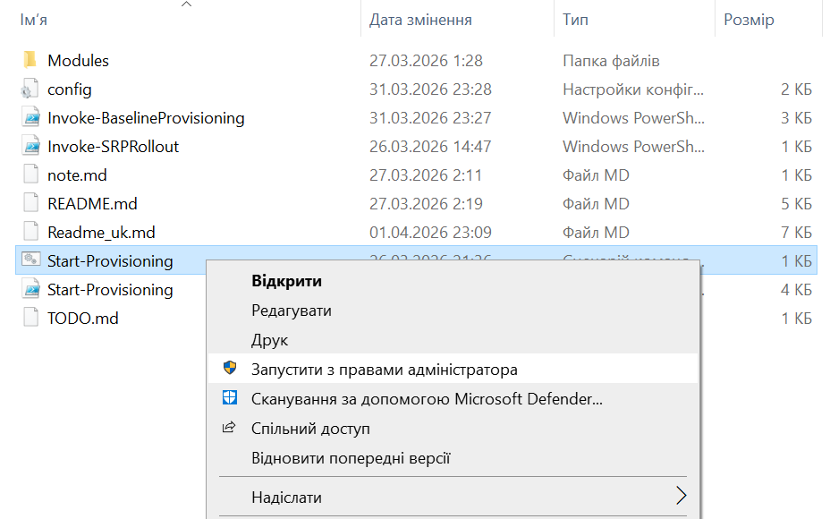
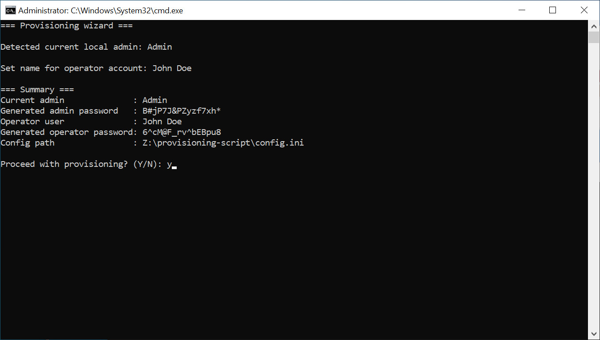
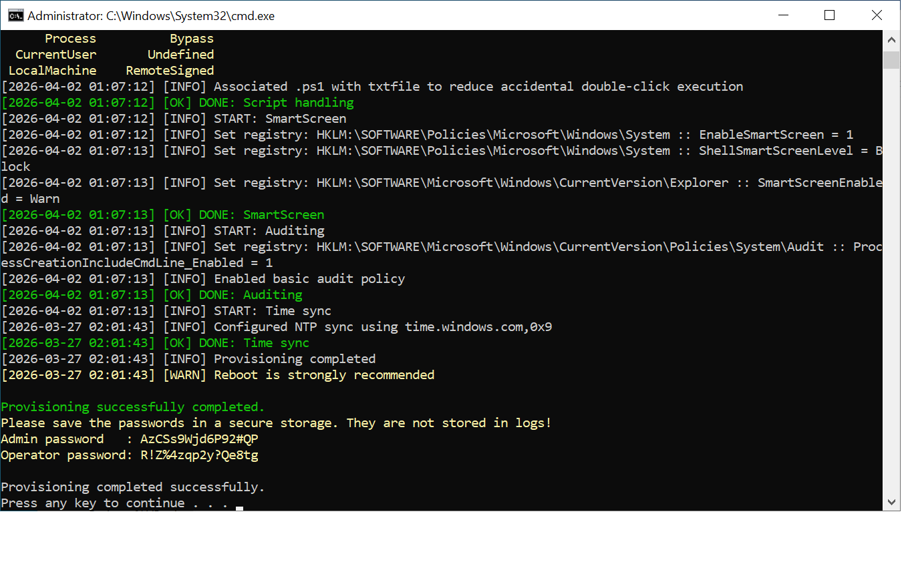

# Базове розгортання (Baseline Provisioning)

## Що це таке

Цей набір скриптів призначений для початкового налаштування ПК на базі Windows 10/11.
Скрипт виконує базові налаштування безпеки та гігієни системи перед початком роботи.


## Інструкція використання

1. Скопіюйте весь каталог зі скриптами на цільовий ПК
2. У каталозі знайдіть `Start-Provisioning.cmd`, клацніть по ньому правою кнопкою миші і виберіть `Запустити з правами адміністратора`.

3. Дозволити цій програмі вносити зміни на вашому пристрої? - Так
4. Відкриється вікно командної строки із перебігом виконання скрипта
5. Скрипт автоматично визначить поточного локального адміністратора
6. На запрошення введіть ім’я користувача-оператора. Скрипт створить користувача для повсякденної роботи з таким ім'ям
7. Скрипт згенерує надійні паролі для користува-адміністратора та користувача-оператора і покаже їх, та деяку іншу інформацію в короткому підсумку
8. Перегляньте підсумок і підтвердіть продовження виконання, вводом букви `Y`

9. Дочекайтеся завершення виконання скрипта
10. Згенеровані паролі користувача-адміністратора та користувача-оператора будуть виведені на консоль - скопіюйте та збережіть їх у надійному місці

Для копіювання із вінкна PowerShell виділіть текст мишкою і клацніть по ньому правою кнопкою - все, він вже у буфері обміну. Можна вставити куди треба.
11. Нажміть любу клавішу для завершення роботи скрипта.

## Додаткові налаштування (config.ini)

За допомогою конфігураційного файла config.ini можна увімкнути/відключити функції. На приклад:

```ini
[BitLocker]
EnableBitLocker=true

[Defender]
EnableControlledFolderAccess=true

[Office]
ConfigureOfficePolicies=true
```

## SRP (обмеження запуску програм)

Software Restriction Policy - можливість заборонити (чи дозволити) запуск прогам із певних директорій. Є ризикованою операцією, тому винсена в окремий скрипт.

Можна запустити командою

```powershell
.\Invoke-SRPRollout.ps1
```

## Структура

* `Start-Provisioning.cmd` — єдина точка входу; запускати від імені адміністратора
* `Start-Provisioning.ps1` — інтерактивний скрипт; збирає дані та запускає процес
* `Invoke-BaselineProvisioning.ps1` — застосовує базові налаштування системи
* `Invoke-SRPRollout.ps1` — окремий скрипт для SRP (ризикові обмеження запуску)
* `config.ini` — конфігурація та перемикачі функцій
* `Modules/` — модулі PowerShell, розбиті за відповідальністю
* `Invoke-BaselineCheck.ps1` — перевіряє стан системи, відповідно до налаштувань у `config.ini`. Запускається через окрему точку входу — `Check-System.cmd`.

## Модулі

* `Config.psm1` — робота з конфігураційним файлом
* `Common.psm1` — логування, перевірка прав адміністратора, допоміжні функції
* `Users.psm1` — створення та налаштування користувачів
* `SecurityBaseline.psm1` — політики паролів, UAC, блокування екрана, аудит
* `WindowsFeatures.psm1` — firewall, оновлення, відключення застарілих функцій, синхронізація часу
* `Defender.psm1` — налаштування Microsoft Defender та SmartScreen
* `BitLocker.psm1` — шифрування диска
* `Office.psm1` — політики безпеки для Office
* `ScriptHandling.psm1` — політики виконання PowerShell
* `SRP.psm1` — обмеження запуску програм
* `Secrets.psm1` — генерація та обробка паролів

## Важливі зауваження

* Перезавантаження після базового налаштування — обов’язкове
* Перезавантаження після SRP — обов’язкове
* Політики Office працюють тільки для Office 16 / Microsoft 365
